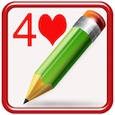

## Welcome to yutianjian's Website

### Feel free to mail me: yu_tian_jian@163.com

#### 欢迎访问中文网页：[http://www.yutianjian.com](https://yu-tian-jian.github.io)

### My IOS ans MAC OS Apps 

My IOS and MAC OS Apps include: Bridge Exercises, Bridge PBN Viewer & Maker, Bridge Team Score, Bridge Pairs Score, Bridge Score Calculator, Chess PGN Viewer, Sudoku Baron, IPTV Player, Family Cashflow, iNotebook, etc.

### My tvOS Apps

My tvOS apps include: Bridge Exercise, fast IPTV Player, etc.

### My Android Apps

My Android Apps (Google play App Store) include: 
(1) Practice Your Bridge, it is same with the iOS app Bridge Exercises.
(2) Bridge PBN Viewer and Maker.
(3) Bridge Score Calculator, it's a tool for Bridge player.
(4) Gobang (Renju, five-in-a-row, Gomoku)
(5) iGo
(6) Hearts Go on
(7) Chess PGN Viewer
(8) IPTV Player (a complete user defined IPTV solutions for live and non-live TV/stream)

## (1) Bridge Exercises

It includes IOS, macOS and tvOS version.

Its free version is Bridge Exercises Lite, with the same function but it contains ad.

It‘s for you to practice bridge, and provide you a lot of classic hands to better understand bridge basic play, it includes:
A good bridge declarer relies on a variety of skills, strategies and techniques, it helps you practice more. 

It's NOT a on-line game, does NOT need internet.

It's simply a bridge table that you can learn bridge technique, train yourselves, enjoy bridge master's skills at anytime and anywhere, and a perfect product for you to improve your playing skills.

### (a) Bridge Exercises

It offers tons of declarer play exercises for players of all skill levels to practice playing skills. 
Level evaluation:
1 star: Winning ratio less than 50%
2 star: Winning ratio more than 50% and leas than 60%
3 star: Winning ratio more than 60% and leas than 70%
4 star: Winning ratio more than 70% and leas than 80%
5 star: Winning ratio more than 80%

### (b) Bridge Basic Play

It SHOWs you a lot of classic hands played by the famous bridge masters with comments to illustrate the various techniques for you to improve your playing skills.
The classic hands include safety play, removing play, block and unblock, killing defense, extra chance, etc, which covers all declarer and defense basic playing skills. 

If you go through all hands with a moment thinking, it would be a noticeable improvement in your playing skill.

Tips for you:
Don't play to the first trick too quickly. Force yourself to stop and think.
Concentrate on the opening lead for a few seconds so you'll remember it later. Decide what it tells you about the leader's length or strength in that suit.
Review the bidding. If one of your opponents has bid, try to come up with a general picture of his point-count and his length in the suit bid.
Always Count your losers and winners.

Hope you become a very good player and have many bridge fun days.

### (c) Bridge Best Hand of The Year

a) The Best Played Hand of the Year (1974-2019)
b) The Best Defence of the Year(1985-2019)
c) The Best Play by a Junior(1996-2019)
d) The BOLS Brilliancy Prize(1977-1987)
e) The Best Play of the Year by a Woman(1985-1986)

### (d) Bridge Bermuda Bowl

It includes (Both Open and Close Room) :
1955, 1957, 1959, 1962, 1967, 1973, 1974, 1975, 1977, 1979, 1981, 1983, 1987, 1991, 1995, 1997, 
2000, 2001, 2003, 2005, 2007, 2009, 2011, 2013, 2015, 2017 Bermuda Bowl Final.

### (e) Easy Bridge

When and where you want to play Bridge, take it Easy. 
Just for fun.

### (f) My Bridge Hands

After setting contract info, you can deal cards manually, then play and save them.

When you see a memorable play or good hands in one web, or in a game, or in a magazine, newspaper, you can play it in your device, enjoy it at any time.

## (2) Bridge PBN Viewer & Maker

Versions for iPad/iPhone and iMac.

Portable Bridge Notation (PBN)

Bridge PBN Viewer
PBN is a universal notation to represent bridge games. It can be used in every bridge program for dealing, bidding, playing, and/or teaching. The notation is suitable for all computer platforms.
There are a lot of Bridge PBN files in websites, You can use Bridge PBN Viewer to read them.

Bridge PBN Maker 
You can create and export your own Bridge PBN files with Bridge PBN Maker, you can save the result of a game as well as specify rules for dealing, bidding, playing, which allows you enjoy the game whenever you want. 

Features
1) Multiple games per PBN file.
2) Displaying PBN Game Contents.
3) Visualizing Bridge cards Moves From Notation.
4) Create and export Bridge PBN files.

## (3) Bridge team score

Support for duplicate bridge scoring (Round Robin):
(1) maximum team number: 22
(2) 25 Rounds: form 1 to 25
(3) 12 Rounds Quarterfinal: segment 1-12
(4) 12 Rounds Semifinal: segment 1-12
(5) 12 Rounds Final: segment 1-12 
(6) Sum score for each Round/QF/SF/Final
(7) Cross table for Round/QF/SF/Final
(8) 2012 WBF Continuous VP Scale
(9) IMP table
(10) Printing support.
(11) No of board 6/7/8/9/10/12/14/16/20/32

IMP - International Match Point
VP - Victory Point (2012 WBF Continuous VP Scale)

## (4) Bridge Pairs Score

Support Standard Mitchell Movements bridge scoring:
(1) Maximum Group number: 6
(2) Maximum Table number for each group: 20
(3) Maximum Board number for each round: 6
(4) Maximum Total Board number: 20*6 = 120
(5) Enter Score By Round 
(6) Show MP Score and Adjust
(7) Show Score of Each Team
(8) Show Sum Score 
(9) Rank: 
Double Championships By Group 
Double Championships By All
Single Championships By Group
Single Championships By All
(10) Printing.
 
